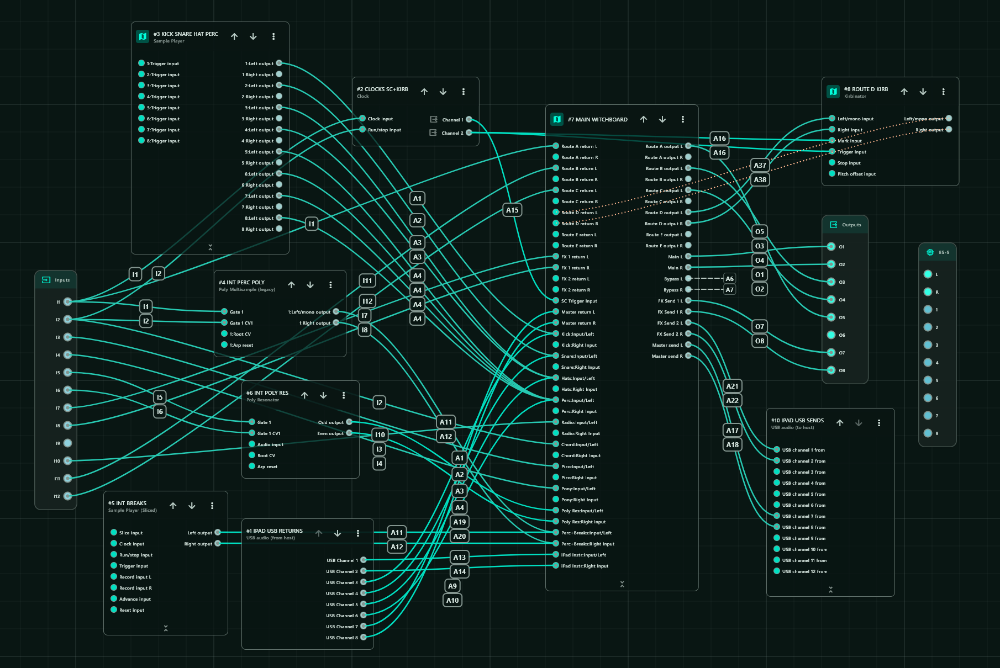

# WitchboardX

## What's new in v1.0.3

- Six assignable insert routes (A–F), up from five.
- Four shared stereo FX sends and returns, up from two. Per-channel Send select
  and Send amount provide one-fader access to all four buses, with independent
  stored levels; active sends are unaffected by bus selection. Dedicated MIDI
  faders remain available for direct control of individual sends.
- Insert return offsets align external insert routes, including PC/iPad FX,
  with their round-trip delays. The largest active route offset sets the
  reference; Witchboard delays faster paths to match. Range: 0 to 20 ms.
- Up to ten channels fit alongside the expanded routing within the disting NT
  parameter limit.

> **Firmware requirement: disting NT v1.18 or later.**

> **Preset warning:** v1.0.3 changes the parameter layout. Do not load presets
> saved with earlier WitchboardX versions directly. 

Witchboard is a routing mixer and serial patchbay plug-in for the Expert Sleepers
disting NT.

It is designed for performance patches where each source behaves like a normal
mixer channel, while also being able to move through hardware inserts, external
processors and shared FX from the NT parameter/MIDI-mapping system.

## Why Witchboard Exists

Witchboard is meant to be the **main performance routing matrix** for a disting NT patch, not just another mixer.

The problem it was built to solve was the growing complexity of a hybrid live setup. Audio sources needed to be mixed, routed through external hardware and software processors, sent to shared effects, split between ducked and non-ducked paths, and finally recombined — all without turning the disting NT patch into a maze of helper algorithms and manual repatching.

A major part of the idea is the insert system. External processors can be wired once, assigned to insert routes, and then **switched, compared and auditioned from the mixer itself**. A channel can move between `Dry`, `Slot 1`, `Slot 2` and `Slot 3` on the fly, making hardware filters, pedals, iPad processing or other effects part of the performance rather than something that has to be physically repatched between ideas.

Witchboard keeps that whole structure inside one mixer:

- each source behaves like a normal stereo mixer channel;
- each channel can route through assignable serial hardware or software inserts;
- insert slots let processors be **changed and auditioned live without rewiring**;
- channels can feed shared FX sends and returns;
- each channel can choose `Main` or `Bypass`;
- `Main` can be trigger-ducked while `Bypass` stays outside the duck;
- Main and Bypass can remain separate or be summed internally;
- the summed signal can optionally pass through a final stereo master insert;
- that final insert can be an iPad, computer, DJ-style processor, hardware chain or mastering processor;
- NT parameters remain directly available for panel, CV and MIDI mapping.

### One Native Algorithm Instead of a Patch Full of Helpers

A major reason Witchboard exists is **CPU efficiency**.

Building the same system from separate disting NT algorithms means stacking mixers, routing utilities, sidechain processing, filters, extra summing stages and other helpers. Witchboard combines those jobs inside one purpose-built native C++ algorithm, avoiding a lot of duplicated routing and processing overhead.

In a real hardware patch, with several channels active, the master filter running and the sidechain pumping, Witchboard typically sits around **17–20% CPU** on my disting NT. That leaves far more of the disting NT available for instruments, samplers, effects and other algorithms.

The point is not simply to cram features into one plug-in. It is to provide the particular mixer/routing system the patch actually needs **without spending a large proportion of the NT's processing budget just assembling it from generic pieces**.

### Built-In Performance Processing

Witchboard also includes two processing tools that are central to how the mixer is intended to be played.

The **trigger-driven sidechain ducker** is built directly into the Main path. The kick or another source can remain on `Bypass`, while a gate or  trigger drives the ducking envelope on `Main`. Depth, Lookahead, Env Length, Curve and Smooth give it a deliberately small set of musical controls rather than turning it into a conventional compressor.

The **master filter** is a DJ-style performance filter with independent low and high cutoff limits plus resonance/Q. Together with the ducker, it provides two of the main performance-processing tools I wanted immediately available on the mixer itself.

That is particularly useful in a compact Eurorack system. I wanted this kind of hands-on mixer/filter/sidechain functionality, but I simply do not have the rack space for something like an **Oxi Instruments Meta**. Witchboard puts those functions inside hardware I already have, while also integrating them directly with the routing and insert system.

### Designed to Be Played

The aim is to make a complicated hardware/software rig feel like **one playable mixer**: wire the system once, then make routing and processing choices from Witchboard while the patch is running.

Witchboard was developed to work particularly nicely with the **Michigan Synth Works XVI-M**. Its physical faders and controls make a great interface for directly mapped Witchboard parameters, so levels, sends, routing and other functions can be manipulated without living in menus.

The XVI-M is **not required**. Witchboard uses normal disting NT parameter mapping, so any suitable MIDI or CV controller can be used.

The important part is the workflow:

```text
wire sources, hardware inserts and FX once
        ↓
route everything through Witchboard
        ↓
audition insert processors on the fly
        ↓
mix and send channels physically
        ↓
separate Main and Bypass as required
        ↓
duck and filter the mix
        ↓
optionally process the final stereo bus
```

The result is one compact, CPU-efficient environment for **mixing, routing, hardware experimentation and live performance**, rather than a collection of unrelated algorithms that happen to be connected together.


## DSP Credits & Why They Were Chosen

Witchboard deliberately builds its core tone-shaping around small, high-quality
open-source DSP designs which suit the disting NT and, more importantly, sound
right for the instrument.

### Filter — Matthijs Hollemans / Cytomic SVF

- [Matthijs Hollemans — Cytomic SVF C++ implementation](https://gist.github.com/hollance/2891d89c57adc71d9560bcf0e1e55c4b)
- [Andrew Simper / Cytomic — *SvfLinearTrapOptimised2*](http://cytomic.com/files/dsp/SvfLinearTrapOptimised2.pdf)

**Why Witchboard chose it:** the topology-preserving state-variable filter gives
the smooth, immediate and musical HP/LP sweep behaviour wanted from
Witchboard's DJ-style filter, while staying compact and practical on the
disting NT. The Witchboard implementation keeps the filter deliberately close
to this source design.

### Trigger ducker — JoyDuck-derived envelope

The ducker uses a single curved recovery envelope, linear-ramp smoothing,
and linear VCA depth. It is JoyDuck-inspired, but it is not claimed to be an
exact Max clone.

**Why Witchboard chose it:** the goal was not to add another conventional
compressor. Witchboard only needs a very good trigger-driven pump that is fast
to set on hardware and uses very few parameters. The JoyDuck-style design gives
that with four musical shaping controls — **Depth, Env Length, Curve and Smooth**
— while `SC Lookahead` lets the gain movement begin before the delayed Main
transient arrives. That keeps the ducker playable and easy to map without
Attack/Hold/Release/Threshold/Makeup controls.

See [Cycling ’74 curve~](https://docs.cycling74.com/reference/curve~/) and
[rampsmooth~](https://docs.cycling74.com/reference/rampsmooth~/).

## Features

- Up to **10 stereo source channels**
- Channel gain up to **+6 dB**, with 0 dB defaults
- Final **Master Gain**, from -12 to +6 dB
- Two serial insert stages per channel
- Six assignable insert routes (A–F)
- Four shared stereo FX sends
- Per-channel timing offsets from −30.0 to 0.0 ms
- Main / Bypass output paths
- Trigger-driven Main ducking with 0–10 ms lookahead
- Bypass Offset with automatic lookahead compensation and 0–100 ms effective delay
- DJ-style HP/LP sweep filter
- Split / Sum / Insert master-output modes
- Master external insert send/return
- Preset-specific route, FX and slot naming
- Parameter smoothing for live routing changes


## Signal Flow

Each source channel runs:

```text
Input L/R
  -> Gain
  -> Insert 1
  -> Insert 2
  -> Per-channel timing offset
  -> FX Sends 1–4
  -> Main or Bypass
```

The two output paths then enter the master section.

### Split

```text
Main   -> SC Lookahead -> Duck VCA -> Filter -> Master Gain -> Main L/R
Bypass -> Bypass Offset ---------------------> Master Gain -> Bypass L/R
```

### Sum

```text
Main   -> SC Lookahead -> Duck VCA --\
                                      +-> Filter -> Master Gain -> Main L/R
Bypass -> Bypass Offset --------------/
```

### Insert

```text
Main   -> SC Lookahead -> Duck VCA --\
                                      +-> Filter -> Master Send -> external processor
Bypass -> Bypass Offset --------------/                                  |
                                                                        v
Main L/R <- Master Gain <- Master Return <-------------------------------+
```

SC Lookahead is active only when Sidechain is On. Bypass Offset delays the
Bypass submix before its destination in all three modes. The Master Insert
round trip affects both branches equally after they have recombined.

## Patch Example



## Channel Controls

Each channel has:

- Enable
- Input L
- Input R
- Gain
- Insert 1
- Insert 1 Slot 1
- Insert 1 Slot 2
- Insert 1 Slot 3
- Send select
- Insert 2
- Insert 2 Slot 1
- Insert 2 Slot 2
- Insert 2 Slot 3
- Output path
- Send amount

`Gain` ranges from -60 dB (mute) to +6 dB, defaulting to 0 dB.
Existing preset gain values and MIDI mapping ranges are preserved.

Unused channels can be disabled or left with no Input L bus assigned.

## Insert Routes

Witchboard has six assignable insert routes:

```text
Route A
Route B
Route C
Route D
Route E
Route F
```

Each route has a send, return and mono/stereo width configuration.

Each channel has two serial insert selectors. Each selector can be:

| Value | State |
|---:|---|
| 0 | Dry |
| 1 | Slot 1 |
| 2 | Slot 2 |
| 3 | Slot 3 |
| 4 | Slot 3 |

The extra top value keeps common four-position MIDI controls such as
`0 / 42 / 85 / 127` landing cleanly on Dry / Slot 1 / Slot 2 / Slot 3 when the
NT mapping range is set to `0..4`.

Each slot can point independently to Route A-F. In the parameter display, the
insert selector asks Witchboard for a custom value string and uses the assigned
route name for the selected slot. For example, if `Insert 1 Slot 1` points to
Route B and Route B is named `Pico MMF`, selecting `Slot 1` displays `Pico MMF`
rather than the generic `Slot 1` label.

`Repeat protection` prevents the same route being used twice in series on one
channel. When protection is Off, the same route may deliberately be selected in
both insert stages.

## FX Sends

Four shared stereo FX paths are available:

- FX Send 1
- FX Send 2
- FX Send 3
- FX Send 4

Each channel has a new **Send select** parameter and a **Send amount**
parameter. Map Send select to a button/controller to choose FX1, FX2, FX3, or
FX4. Map Send amount to one fader. The button chooses which send the fader
controls; Witchboard remembers a separate level for every send and recalls it
when selected. All four sends stay active at their saved levels, so you can
balance several effects on one channel with one button and one fader.

For example, select FX1 and set it to 35%, then select FX3 and set it to 20%.
That channel now feeds FX1 and FX3 at those levels simultaneously. Selecting
FX1 again recalls 35%; moving the fader changes FX1 without altering FX3.
**Send amount** ranges from 0–100. The selector displays the FX's preset name
when one is set; its values are 0 = FX1, 1 = FX2, 2 = FX3, and 3 or 4 = FX4.

For a four-position MIDI button/control, map Send select over 0–4. Values 0,
42, 85, and 127 select FX1, FX2, FX3, and FX4. FX4 accepts both selector values
3 and 4 so the top position maps reliably. If you prefer direct control, assign
a dedicated MIDI fader to each send; you can use those alongside the
button-and-fader workflow.

The selected send's mix amount uses an overlap shape:

```text
0%        dry 1.0, wet 0.0
50%       dry 1.0, wet 1.0
100%      dry 0.0, wet 1.0
```

From 0–50%, dry stays full while wet fades in.

From 50–100%, wet stays full while dry fades out. The dry factors for the four
sends multiply, while each wet feed is controlled by its own saved amount.

Each FX return can be assigned to Main or Bypass.

Optional dedicated per-send MIDI faders and a shared fader with pickup can
control these levels. See the
[six-route/four-send guide](docs/six-routes-four-sends.md) for setup.

## Sidechain and latency alignment

The ducker affects Main only. Feed a trigger into `SC Trigger Input`: each
rising crossing of absolute 0.1 starts a normalized envelope at 0 (deepest duck),
recovering to 1 (unity). A sustained high trigger does not keep restarting it.
A new rising trigger starts the same envelope again, including during recovery.

| Control | Range | Initial value |
| --- | --- | --- |
| Sidechain | Off / On | Off |
| SC Trigger Input | NT CV/input bus | None |
| SC Depth | 0–100% | 69% |
| SC Lookahead | 0–10 ms, 0.1 ms steps | 6 ms |
| SC Env Length | 50–2000 ms, logarithmic | Approximately 300 ms |
| SC Curve | -100–100 | +20 |
| SC Smooth | 0–100% (0–200 ms) | 4% (8 ms) |

### What `SC Curve` actually does

`SC Curve` changes the **shape of the 0 -> 1 gain recovery** after a trigger.
It does not change the total `SC Env Length`.

```text
vertical axis   = ducker gain: 0 = deepest duck, 1 = unity
horizontal axis = time through SC Env Length


SC Curve < 0        SC Curve = 0        SC Curve > 0

1 |       ____      1 |        /        1 |           /
  |    __/            |      /            |         _/
  |  _/               |    /              |       _/
  |_/                  |  /                |    __/
0 +---------- time   0 +---------- time   0 +---------- time

fast early recovery    linear recovery       slow early recovery
soft/slower tail                              steep/fast finish
```

Practical interpretation:

| Curve | Shape / feel |
| ---: | --- |
| `-100` | very concave: gets out of the deepest duck very quickly, then eases toward unity |
| `-50` | moderately concave: punchy early recovery with a softer tail |
| `0` | straight line: constant-rate recovery |
| `+50` | moderately convex: stays lower for longer, then rises faster near the end |
| `+100` | very convex: strongest hold-down feeling, with the steepest late recovery |

So negative does **not** mean more duck and positive does **not** mean less duck.
`SC Depth` controls how deep the VCA goes; `SC Curve` only redistributes the
recovery speed across the same total envelope duration.

Env Length controls the complete raw recovery, with knob positions
0/25/50/75/100% giving approximately 50/126/316/796/2000 ms. The stored/mapped
Env Length value is normalized 0–1000; its parameter string displays
milliseconds. Length/Curve edits apply on the next trigger; Smooth and Depth are
read each audio block.

Processing order is **Curve → Smooth → Depth → VCA**. Smooth restarts a linear
ramp to each changed envelope value, using equal rise/fall times. Its tail can
extend beyond the raw Env Length. Depth uses `gain = 1 - depth * (1 - envelope)`:
50% depth reaches gain 0.5 (about -6 dB), and 100% depth can reach zero with
Smooth at zero. Smoothing can reduce the deepest duck on a moving envelope.
There are no Attack/Hold/Release/Makeup, Gate/Audio modes, or breakpoints.

### Output / latency alignment — `Bypass Offset`

The final Latency page shows SC Lookahead, Bypass Offset, Insert route, and
Insert return offset. SC Lookahead is the same parameter shown on Sidechain/Master.

| Control | Range | Initial value |
| --- | --- | --- |
| Bypass Offset | 0–100 ms, 0.1 ms steps | 0 ms with SC Off |

Lookahead delays Main audio before the VCA; the trigger stays immediate. When
SC is on, changing SC Lookahead copies its value to Bypass Offset so the two
audio paths align. For example, 6 ms Lookahead sets Bypass Offset to 6 ms.
You can then set Bypass Offset to an absolute manual value, such as 10 ms.
It stays there until the next SC Lookahead or Sidechain mode change, which
copies the active lookahead again. With SC off, the automatic value is 0 ms.
MIDI/CV Lookahead changes use the same rule. A manual override saves with the
preset; older hidden trim metadata is ignored.

Physical Bypass delay ranges from 0–100 ms. Insert return offset aligns an
external insert route with the rest of the mix; it is a separate control.
See [the Latency page guide](docs/latency-page-guide.md) for a setup example.

Both delays crossfade old/new taps over 5 ms. Rapid requests finish the current
fade, then fade toward the latest target, so settling can take up to 10 ms.
Delay history stays populated at zero delay. After a live SC Off transition
settles, Main adds no lookahead latency; manual Bypass Offset remains active.
At SC Off and Bypass Offset zero there is no new steady-state latency.

### Insert return alignment — PC or iPad inserts

If an external insert route returns late, open the final Latency page, select
its physical **Insert route** (A–F), and set **Insert return offset** to its
measured roundtrip latency, from 0.0 to 20.0 ms in 0.1 ms steps. For example,
if a Channel 2 iPad insert uses route E and returns 12 ms late, select E and
set 12.0 ms. The setting belongs to route E, including when multiple channels
share that physical insert return.

The largest active insert route offset sets the common alignment delay. Faster
Main, Bypass, sidechain key, and insert paths are held back to match. This
cannot make an external return arrive earlier. FX sends and FX returns have no
separate offset control. See [insert return timing](docs/insert-return-timing.md).

Factory sidechain values are **Depth 69%**, **Lookahead 6 ms**, **Env Length about 300 ms**, **Curve +20**, and **Smooth 4% (8 ms)**. Sidechain itself defaults to **Off**, so enabling it gives the intended musical pump without forcing ducking on every new patch.

## Filter

The master filter is a state-variable DJ-style sweep filter.

| Parameter | Range | Default |
|---|---:|---:|
| `Filter enable` | Off / On | Off |
| `HP limit` | 0..100% | 20% |
| `LP limit` | 0..100% | 70% |
| `Filter Q` | 0..100% | 10% |
| `Filter sweep` | -100..100% | 0% |

`Filter sweep` works around a clean centre:

```text
-100 ... -1   low-pass side
0             filter bypass
+1 ... +100   high-pass side
```

The cutoff mapping is logarithmic from approximately 20 Hz to 20 kHz, clamped
below Nyquist.

`LP limit` and `HP limit` define the extremes reached by the negative and
positive sides of the sweep.

`Filter Q` maps from approximately `0.707` to `12`.

## Master Inserts & Output

`Master output` has three modes:

| Mode | Behaviour |
|---|---|
| `Split` | Main -> Main L/R; Bypass -> Bypass L/R |
| `Sum` | Main + Bypass -> Main L/R |
| `Insert` | Main + Bypass -> Master Send; Master Return -> Main L/R |

Master Inserts use:

- `Master send L`
- `Master send R`
- `Master return L`
- `Master return R`

`Master Gain` is on the Sidechain/Master page, after the master routing controls.
It ranges from -12 to +6 dB, defaults to 0 dB, and ramps over 10 ms when moved.
It scales Witchboard's final Main and Bypass outputs without changing the signal
driving the internal sidechain or filter. In Insert mode it scales the
master return; the master send level is unchanged. It does not scale existing
audio from other algorithms already on the output buses.

## Output Paths

Every channel can choose:

- Main
- Bypass

Use Main for channels that should pass through the sidechain stage.

Use Bypass for channels that should avoid sidechain gain shaping and either stay
separate in Split mode or rejoin the master stage in Sum/Insert mode.

All Witchboard output buses are additive.

## Switching and Smoothing

`Switch fade` controls the transition time used for live routing changes and
channel smoothing.

```text
0..100 ms
default: 2 ms
```

Channel gain, insert switching and FX-send moves use this smoothing system.

## Preset Naming

Witchboard can store preset-specific display names for channels, routes, FX sends
and optional slot-state overrides.

```text
witchboardNames.channels
witchboardNames.routes
witchboardNames.fx
witchboardNames.slots
```

These names affect the UI only; routing behaviour remains generic.

`witchboardNames.channels` names the channel pages and the parameter UI prefixes.
If a preset has fewer channel names than active channels, missing names fall back
to `Channel 1`, `Channel 2` and so on.

Slot names are normally automatic. For each channel, `Insert 1` and `Insert 2`
look at the selected slot's route assignment and display that route's name:

```text
Insert 1 Slot 1 = Route B
Route B name    = Pico MMF
Insert 1 state  = Slot 1
Displayed value = Pico MMF
```

`witchboardNames.slots` is only needed when a preset wants to override that
automatic display. Empty strings, missing slot names, or the default strings
`Slot 1`, `Slot 2` and `Slot 3` mean "auto-name from the assigned route".

Example:

```json
"witchboardNames": {
  "channels": ["Kick", "Snare", "Hats", "Perc"],
  "routes": ["Percall 1", "Pico MMF", "Steve's MS-22", "Kirbinator", "Unused"],
  "fx": ["Radiant", "Main FX 2"],
  "slots": [
    ["Dry", "", "", ""],
    ["Dry", "", "", ""]
  ]
}
```

## Installation

```text
Name: WitchboardX
GUID: WtbX
Artifact: WitchboardX.o
```

Copy the built object to the disting NT MicroSD plug-in directory, then rescan
plug-ins or restart the module.

This release has a different parameter layout from earlier WitchboardX builds.
Load the included matching preset or convert a supported preset before loading;
do not reuse an older preset directly. The supplied conversion helper supports
the personal eight-route/two-send layout with up to ten channels:

```sh
python3 scripts/migrate_six_routes_four_sends.py old.json six-four.json --channels 10
python3 scripts/migrate_channel_offsets.py six-four.json migrated.json
```

The converter preserves other algorithms and stops if it finds unsupported
routes or mappings rather than silently discarding them. It does not convert
the earlier public-release preset layout. Back up presets before conversion;
the helper writes a new file and refuses to overwrite an existing destination.

## JSON Naming Guide

WitchboardX stores its private display labels in the preset JSON under
`witchboardNames`. These names are not normal NT parameters; edit them in JSON
and reload the preset.

The safest workflow is:

1. Save the preset from the disting NT.
2. Make a backup copy of the JSON before editing.
3. Open the preset JSON in a text editor that preserves plain text.
4. Search for `"guid": "WtbX"`. This is the WitchboardX slot.
5. In that same slot, find or add `"witchboardNames"`.
6. Edit only the strings inside `channels`, `routes`, `fx` and optional `slots`.
7. Validate the JSON if possible, then copy it back to the disting NT and reload
   the preset.

The repository preset [presets/WitchboardX.json](presets/WitchboardX.json) is a
working example with channel names, route names and FX names already present.

Do not move or renumber the large `parameters` array by hand unless you are
deliberately editing parameter values. Names live beside that array, not inside
it.

Minimal shape inside the `WtbX` slot:

```json
{
  "guid": "WtbX",
  "specs": [10, 0, 0],
  "witchboardNames": {
    "channels": ["Kick", "Snare"],
    "routes": [
      "Percall 1",
      "Pico MMF",
      "Steve's MS-22",
      "Kirbinator",
      "Unused",
      "Route F",
      "Route G",
      "Route H"
    ],
    "fx": ["Radiant", "Main FX 2"]
  },
  "name": "MAIN WITCHBOARD        ",
  "parameters": [ ... ]
}
```

If `witchboardNames` already exists, just edit or add members inside it. If it
does not exist, add it before `"name"` or before `"parameters"` in the `WtbX`
slot, with a comma between JSON members.

Full naming example:

```json
"witchboardNames": {
  "channels": [
    "Kick",
    "Snare",
    "Hats",
    "Perc",
    "Radio",
    "Chord",
    "Pico",
    "Pony",
    "Poly Res",
    "Perc+Breaks"
  ],
  "routes": [
    "Percall 1",
    "Pico MMF",
    "Steve's MS-22",
    "Kirbinator",
    "Unused",
    "Route F",
    "Route G",
    "Route H"
  ],
  "fx": [
    "Radiant",
    "Main FX 2"
  ],
  "slots": [
    ["Dry", "", "", ""],
    ["Dry", "", "", ""]
  ]
}
```

`channels` names the channel pages and channel prefixes. The first string is
channel 1, the second is channel 2, and so on. If there are fewer names than
active channels, the missing channels fall back to `Channel 1`, `Channel 2`, etc.
Extra names are ignored.

`routes` names Route A-H. The first string is Route A, the second is Route B,
through Route H.

`fx` names FX Send 1 and FX Send 2.

`slots` is optional. Empty strings, missing slot entries, or the default strings
`Slot 1`, `Slot 2` and `Slot 3` mean "auto-name from the route assigned to that
slot".

Slot arrays are arranged as:

```text
[
  [Insert 1 Dry, Insert 1 Slot 1, Insert 1 Slot 2, Insert 1 Slot 3],
  [Insert 2 Dry, Insert 2 Slot 1, Insert 2 Slot 2, Insert 2 Slot 3]
]
```

Usually this is enough:

```json
"slots": [
  ["Dry", "", "", ""],
  ["Dry", "", "", ""]
]
```

With that setup, the Disting displays the assigned route name. For example, if
`Insert 1 Slot 1` points to Route B and Route B is named `Pico MMF`, selecting
Slot 1 displays `Pico MMF`.

The baseline preset currently uses the default strings:

```json
"slots": [
  ["Dry", "Slot 1", "Slot 2", "Slot 3"],
  ["Dry", "Slot 1", "Slot 2", "Slot 3"]
]
```

In WitchboardX those default slot strings still keep auto naming active, so the
display follows the assigned route names.

Actual baseline example from
[presets/WitchboardX.json](presets/WitchboardX.json):

```json
"witchboardNames": {
  "channels": [
    "Kick",
    "Snare",
    "Hats",
    "Perc",
    "Radio",
    "Chord",
    "Pico",
    "Pony",
    "Poly Res",
    "Perc+Breaks"
  ],
  "routes": [
    "Percall 1",
    "Pico MMF",
    "Steve's MS-22",
    "Kirbinator",
    "Unused",
    "Route F",
    "Route G",
    "Route H"
  ],
  "fx": [
    "Radiant",
    "Main FX 2"
  ],
  "slots": [
    ["Dry", "Slot 1", "Slot 2", "Slot 3"],
    ["Dry", "Slot 1", "Slot 2", "Slot 3"]
  ]
}
```

In the current plugin, the default slot strings shown above still mean
"auto-name from the assigned route".

Practical JSON rules:

- Keep double quotes around every name.
- Put commas between items, but not after the final item in an array/object.
- Use plain ASCII apostrophes if you can, for example `Steve's MS-22`.
- Keep labels short. Witchboard stores each channel/route/FX name in a 24-byte
  field, and channel prefixes are shortened further for the NT prefix display.
