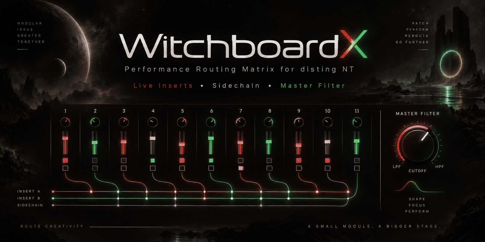
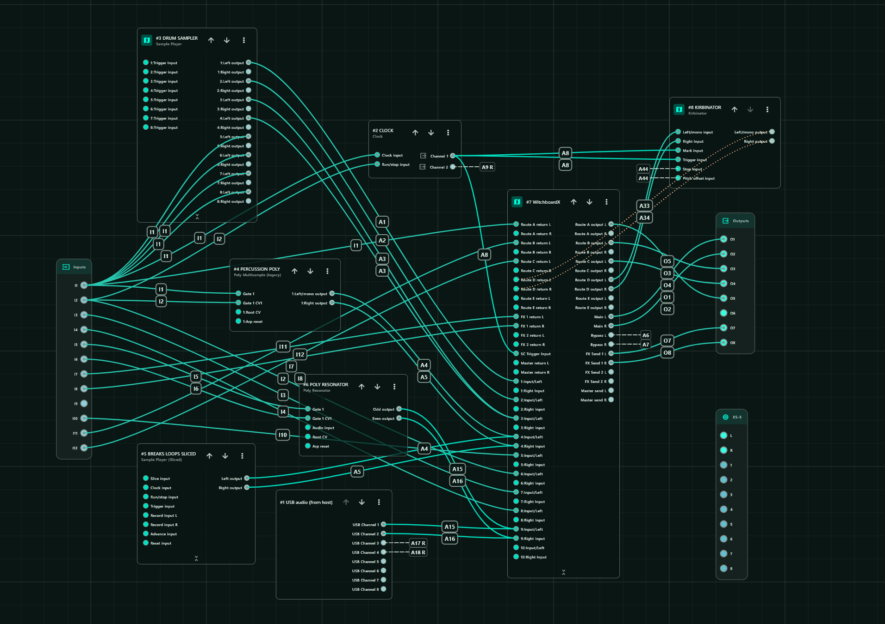

# WitchboardX

> **Firmware requirement: disting NT v1.19 beta, currently available only via Discord.**
> Witchboard places cold code, including preset serialisation code, in DRAM and requires this firmware support.

Witchboard is a routing mixer and serial patchbay plug-in for the Expert Sleepers
disting NT.

It is designed for performance patches where each source behaves like a normal
mixer channel, while also being able to move through hardware inserts, external
processors and shared FX from the NT parameter/MIDI-mapping system.

## Why Witchboard Exists

Witchboard is meant to be the **main performance routing matrix** for a disting NT patch, not just another mixer.

The problem it was built to solve was the growing complexity of a hybrid live setup. Audio sources needed to be mixed, routed through external hardware and software processors, sent to shared effects, split between ducked and non-ducked paths, and finally recombined — all without turning the disting NT patch into a maze of helper algorithms and manual repatching.

A major part of the idea is the insert system. External processors can be wired once, assigned to insert routes, and then **switched, compared and auditioned from the mixer itself**. A channel can move between `Dry`, `Slot 1`, `Slot 2` and `Slot 3` on the fly, making hardware filters, pedals, iPad processing or other effects part of the performance rather than something that has to be physically repatched between ideas.

Witchboard keeps that whole structure inside one mixer:

- each source behaves like a normal stereo mixer channel;
- each channel can route through assignable serial hardware or software inserts;
- insert slots let processors be **changed and auditioned live without rewiring**;
- channels can feed shared FX sends and returns;
- each channel can choose `Main` or `Bypass`;
- `Main` can be trigger-ducked while `Bypass` stays outside the duck;
- Main and Bypass can remain separate or be summed internally;
- the summed signal can optionally pass through a final stereo master insert;
- that final insert can be an iPad, computer, DJ-style processor, hardware chain or mastering processor;
- NT parameters remain directly available for panel, CV and MIDI mapping.

### One Native Algorithm Instead of a Patch Full of Helpers

A major reason Witchboard exists is **CPU efficiency**.

Building the same system from separate disting NT algorithms means stacking mixers, routing utilities, sidechain processing, filters, extra summing stages and other helpers. Witchboard combines those jobs inside one purpose-built native C++ algorithm, avoiding a lot of duplicated routing and processing overhead.

In a real hardware patch, with several channels active, the master filter running and the sidechain pumping, Witchboard typically sits around **17–20% CPU** on my disting NT. That leaves far more of the disting NT available for instruments, samplers, effects and other algorithms.

The point is not simply to cram features into one plug-in. It is to provide the particular mixer/routing system the patch actually needs **without spending a large proportion of the NT's processing budget just assembling it from generic pieces**.

### Built-In Performance Processing

Witchboard also includes two processing tools that are central to how the mixer is intended to be played.

The **trigger-driven sidechain ducker** is built directly into the Main path. The kick or another source can remain on `Bypass`, while a gate or  trigger drives the ducking envelope on `Main`. Depth, Lookahead, Env Length, Curve and Smooth give it a deliberately small set of musical controls rather than turning it into a conventional compressor.

The **master filter** is a DJ-style performance filter with independent low and high cutoff limits plus resonance/Q. Together with the ducker, it provides two of the main performance-processing tools I wanted immediately available on the mixer itself.

That is particularly useful in a compact Eurorack system. I wanted this kind of hands-on mixer/filter/sidechain functionality, but I simply do not have the rack space for something like an **Oxi Instruments Meta**. Witchboard puts those functions inside hardware I already have, while also integrating them directly with the routing and insert system.

### Designed to Be Played

The aim is to make a complicated hardware/software rig feel like **one playable mixer**: wire the system once, then make routing and processing choices from Witchboard while the patch is running.

Witchboard was developed to work particularly nicely with the **Michigan Synth Works XVI-M**. Its physical faders and controls make a great interface for directly mapped Witchboard parameters, so levels, sends, routing and other functions can be manipulated without living in menus.

The XVI-M is **not required**. Witchboard uses normal disting NT parameter mapping, so any suitable MIDI or CV controller can be used.

The important part is the workflow:

```text
wire sources, hardware inserts and FX once
        ↓
route everything through Witchboard
        ↓
audition insert processors on the fly
        ↓
mix and send channels physically
        ↓
separate Main and Bypass as required
        ↓
duck and filter the mix
        ↓
optionally process the final stereo bus
```

The result is one compact, CPU-efficient environment for **mixing, routing, hardware experimentation and live performance**, rather than a collection of unrelated algorithms that happen to be connected together.


## DSP Credits & Why They Were Chosen

Witchboard deliberately builds its core tone-shaping around small, high-quality
open-source DSP designs which suit the disting NT and, more importantly, sound
right for the instrument.

### Filter — Matthijs Hollemans / Cytomic SVF

- [Matthijs Hollemans — Cytomic SVF C++ implementation](https://gist.github.com/hollance/2891d89c57adc71d9560bcf0e1e55c4b)
- [Andrew Simper / Cytomic — *SvfLinearTrapOptimised2*](http://cytomic.com/files/dsp/SvfLinearTrapOptimised2.pdf)

**Why Witchboard chose it:** the topology-preserving state-variable filter gives
the smooth, immediate and musical HP/LP sweep behaviour wanted from
Witchboard's DJ-style filter, while staying compact and practical on the
disting NT. The Witchboard implementation keeps the filter deliberately close
to this source design.

### Trigger ducker — JoyDuck-derived envelope

The ducker uses a single curved recovery envelope, linear-ramp smoothing,
and linear VCA depth. Its curve coefficient mapping follows the handoff's
Max-community recurrence candidate; it is not claimed to be an exact Max clone.

**Why Witchboard chose it:** the goal was not to add another conventional
compressor. Witchboard only needs a very good trigger-driven pump that is fast
to set on hardware and uses very few parameters. The JoyDuck-style design gives
that with four musical shaping controls — **Depth, Env Length, Curve and Smooth**
— while `SC Lookahead` lets the gain movement begin before the delayed Main
transient arrives. That keeps the ducker playable and easy to map without
Attack/Hold/Release/Threshold/Makeup controls.

See [Cycling ’74 curve~](https://docs.cycling74.com/reference/curve~/) and
[rampsmooth~](https://docs.cycling74.com/reference/rampsmooth~/).

## Features

- Up to **11 stereo source channels**
- Channel gain up to **+6 dB**, with 0 dB defaults
- Final **Master Gain**, from -12 to +6 dB
- Two serial insert stages per channel
- Five assignable insert routes
- Two shared stereo FX sends
- Main / Bypass output paths
- Trigger-driven Main ducking with 0–10 ms lookahead
- Bypass Offset with automatic lookahead compensation and 0–100 ms effective delay
- DJ-style HP/LP sweep filter
- Split / Sum / Insert master-output modes
- Master external insert send/return
- Preset-specific route, FX and slot naming
- Parameter smoothing for live routing changes


## Signal Flow

Each source channel runs:

```text
Input L/R
  -> Gain
  -> Insert 1
  -> Insert 2
  -> FX Send 1
  -> FX Send 2
  -> Main or Bypass
```

The two output paths then enter the master section.

### Split

```text
Main   -> SC Lookahead -> Duck VCA -> Filter -> Master Gain -> Main L/R
Bypass -> Bypass Offset ---------------------> Master Gain -> Bypass L/R
```

### Sum

```text
Main   -> SC Lookahead -> Duck VCA --\
                                      +-> Filter -> Master Gain -> Main L/R
Bypass -> Bypass Offset --------------/
```

### Insert

```text
Main   -> SC Lookahead -> Duck VCA --\
                                      +-> Filter -> Master Send -> external processor
Bypass -> Bypass Offset --------------/                                  |
                                                                        v
Main L/R <- Master Gain <- Master Return <-------------------------------+
```

SC Lookahead is active only when Sidechain is On. Bypass Offset delays the
Bypass submix before its destination in all three modes. The Master Insert
round trip affects both branches equally after they have recombined.

## Patch Example



## Channel Controls

Each channel has:

- Enable
- Input L
- Input R
- Gain
- Insert 1
- Insert 1 Slot 1
- Insert 1 Slot 2
- Insert 1 Slot 3
- FX Send 1 mix
- Insert 2
- Insert 2 Slot 1
- Insert 2 Slot 2
- Insert 2 Slot 3
- Output path
- FX Send 2 mix

`Gain` ranges from -60 dB (mute) to +6 dB, defaulting to 0 dB.
Existing preset gain values and MIDI mapping ranges are preserved.

Unused channels can be disabled or left with no Input L bus assigned.

## Insert Routes

Witchboard has five assignable insert routes:

```text
Route A
Route B
Route C
Route D
Route E
```

Each route has a send, return and mono/stereo width configuration.

Each channel has two serial insert selectors. Each selector can be:

| Value | State |
|---:|---|
| 0 | Dry |
| 1 | Slot 1 |
| 2 | Slot 2 |
| 3 | Slot 3 |
| 4 | Slot 3 |

The extra top value keeps common four-position MIDI controls such as
`0 / 42 / 85 / 127` landing cleanly on Dry / Slot 1 / Slot 2 / Slot 3 when the
NT mapping range is set to `0..4`.

Each slot can point independently to Route A-E.

`Repeat protection` prevents the same route being used twice in series on one
channel. When protection is Off, the same route may deliberately be selected in
both insert stages.

## FX Sends

Two shared stereo FX paths are available:

- FX Send 1
- FX Send 2

Each channel has an `FX Send 1 mix` and `FX Send 2 mix`.

The mix control uses an overlap shape:

```text
0%        dry 1.0, wet 0.0
50%       dry 1.0, wet 1.0
100%      dry 0.0, wet 1.0
```

From 0-50%, dry stays full while wet fades in.

From 50-100%, wet stays full while dry fades out.

Each FX return can be assigned to Main or Bypass.

## Sidechain and latency alignment

The ducker affects Main only. Feed a trigger into `SC Trigger Input`: each
rising crossing of absolute 0.1 starts a normalized envelope at 0 (deepest duck),
recovering to 1 (unity). A sustained high trigger does not keep restarting it.
A new rising trigger starts the same envelope again, including during recovery.

| Control | Range | Initial value |
| --- | --- | --- |
| Sidechain | Off / On | Off |
| SC Trigger Input | NT CV/input bus | None |
| SC Depth | 0–100% | 69% |
| SC Lookahead | 0–10 ms, 0.1 ms steps | 6 ms |
| SC Env Length | 50–2000 ms, logarithmic | Approximately 300 ms |
| SC Curve | -100–100 | +20 |
| SC Smooth | 0–100% (0–200 ms) | 4% (8 ms) |

### What `SC Curve` actually does

`SC Curve` changes the **shape of the 0 -> 1 gain recovery** after a trigger.
It does not change the total `SC Env Length`.

```text
vertical axis   = ducker gain: 0 = deepest duck, 1 = unity
horizontal axis = time through SC Env Length


SC Curve < 0        SC Curve = 0        SC Curve > 0

1 |       ____      1 |        /        1 |           /
  |    __/            |      /            |         _/
  |  _/               |    /              |       _/
  |_/                  |  /                |    __/
0 +---------- time   0 +---------- time   0 +---------- time

fast early recovery    linear recovery       slow early recovery
soft/slower tail                              steep/fast finish
```

Practical interpretation:

| Curve | Shape / feel |
| ---: | --- |
| `-100` | very concave: gets out of the deepest duck very quickly, then eases toward unity |
| `-50` | moderately concave: punchy early recovery with a softer tail |
| `0` | straight line: constant-rate recovery |
| `+50` | moderately convex: stays lower for longer, then rises faster near the end |
| `+100` | very convex: strongest hold-down feeling, with the steepest late recovery |

So negative does **not** mean more duck and positive does **not** mean less duck.
`SC Depth` controls how deep the VCA goes; `SC Curve` only redistributes the
recovery speed across the same total envelope duration.

Env Length controls the complete raw recovery, with knob positions
0/25/50/75/100% giving approximately 50/126/316/796/2000 ms. The stored/mapped
Env Length value is normalized 0–1000; its parameter string displays
milliseconds. Length/Curve edits apply on the next trigger; Smooth and Depth are
read each audio block.

Processing order is **Curve → Smooth → Depth → VCA**. Smooth restarts a linear
ramp to each changed envelope value, using equal rise/fall times. Its tail can
extend beyond the raw Env Length. Depth uses `gain = 1 - depth * (1 - envelope)`:
50% depth reaches gain 0.5 (about -6 dB), and 100% depth can reach zero with
Smooth at zero. Smoothing can reduce the deepest duck on a moving envelope.
There are no Attack/Hold/Release/Makeup, Gate/Audio modes, or breakpoints.

### Output / latency alignment — `Bypass Offset`

`Bypass Offset` belongs conceptually to the output/routing side of Witchboard,
not to the ducker itself.

| Control | Range | Initial value |
| --- | --- | --- |
| Bypass Offset | 0–100 ms, 0.1 ms steps | 0 ms with SC Off |

Lookahead delays Main audio before the VCA; the trigger stays immediate.
Bypass Offset is the effective, visible and saved delay in every master mode.
With SC On and Lookahead 6 ms it follows to 6 ms automatically. Set it to 10 ms
for a +4 ms manual trim; increasing Lookahead to 8 ms then displays 12 ms.
Switching SC Off removes its automatic contribution but retains the manual trim.
MIDI/CV Lookahead updates follow the same audio-block logic as front-panel edits.
A simultaneous direct Bypass edit is interpreted against the previous automatic
contribution, then the new contribution is applied.

Physical delay clamps to 0–100 ms. Hidden trim metadata preserves manual intent
at either limit, including across preset save/load; a direct Bypass Offset edit
replaces that trim. A positive-only Bypass delay cannot advance a late Bypass
branch. Per-channel signed compensation is a future feature.

Both delays crossfade old/new taps over 5 ms. Rapid requests finish the current
fade, then fade toward the latest target, so settling can take up to 10 ms.
Delay history stays populated at zero delay. After a live SC Off transition
settles, Main adds no lookahead latency; manual Bypass Offset remains active.
At SC Off and Bypass Offset zero there is no new steady-state latency.

Factory sidechain values are **Depth 69%**, **Lookahead 6 ms**, **Env Length about 300 ms**, **Curve +20**, and **Smooth 4% (8 ms)**. Sidechain itself defaults to **Off**, so enabling it gives the intended musical pump without forcing ducking on every new patch.

## Filter

The master filter is a state-variable DJ-style sweep filter.

| Parameter | Range | Default |
|---|---:|---:|
| `Filter enable` | Off / On | Off |
| `HP limit` | 0..100% | 20% |
| `LP limit` | 0..100% | 70% |
| `Filter Q` | 0..100% | 10% |
| `Filter sweep` | -100..100% | 0% |

`Filter sweep` works around a clean centre:

```text
-100 ... -1   low-pass side
0             filter bypass
+1 ... +100   high-pass side
```

The cutoff mapping is logarithmic from approximately 20 Hz to 20 kHz, clamped
below Nyquist.

`LP limit` and `HP limit` define the extremes reached by the negative and
positive sides of the sweep.

`Filter Q` maps from approximately `0.707` to `12`.

## Master Inserts & Output

`Master output` has three modes:

| Mode | Behaviour |
|---|---|
| `Split` | Main -> Main L/R; Bypass -> Bypass L/R |
| `Sum` | Main + Bypass -> Main L/R |
| `Insert` | Main + Bypass -> Master Send; Master Return -> Main L/R |

Master Inserts use:

- `Master send L`
- `Master send R`
- `Master return L`
- `Master return R`

`Master Gain` is on the Sidechain/Master page, after the master routing controls.
It ranges from -12 to +6 dB, defaults to 0 dB, and ramps over 10 ms when moved.
It scales Witchboard's final Main and Bypass outputs without changing the signal
driving the internal sidechain or filter. In Insert mode it scales the
master return; the master send level is unchanged. It does not scale existing
audio from other algorithms already on the output buses.

## Output Paths

Every channel can choose:

- Main
- Bypass

Use Main for channels that should pass through the sidechain stage.

Use Bypass for channels that should avoid sidechain gain shaping and either stay
separate in Split mode or rejoin the master stage in Sum/Insert mode.

All Witchboard output buses are additive.

## Switching and Smoothing

`Switch fade` controls the transition time used for live routing changes and
channel smoothing.

```text
0..100 ms
default: 2 ms
```

Channel gain, insert switching and FX-send moves use this smoothing system.

## Preset Naming

Witchboard can store preset-specific display names for routes, FX sends and slot
states.

```text
witchboardNames.routes
witchboardNames.fx
witchboardNames.slots
```

These names affect the UI only; routing behaviour remains generic.

## Installation

```text
Name: WitchboardX
GUID: WtbX
Artifact: WitchboardX.o
```

Copy the built object to the disting NT MicroSD plug-in directory, then rescan
plug-ins or restart the module.

The parameter layout changed. Migrate older WtSF/WtEQ/WtbX presets before loading:

```sh
python3 scripts/migrate_v134_preset.py old.json migrated.json
```

The converter preserves channels, routes, filter, final gain, names and compatible
mappings. It removes EQ and obsolete ducker mappings, resets the new ducker to
its initial settings with Sidechain Off, and preserves Trigger Input and Depth.
It writes a new file and refuses to overwrite an existing destination. Already converted presets pass through unchanged.

## disting NT v1.19 Beta / DRAM Code Placement

For development builds targeting the first disting NT **v1.19 beta**, the
Expert Sleepers API now supports placing selected plug-in functions in DRAM:

```cpp
_NT_DRAM_SECTION
void someColdFunction(...)
{
    ...
}
```

`_NT_DRAM_SECTION` maps the function to the `._nt_dram` section.

Witchboard should use this only for cold/setup/UI/preset code where appropriate,
while keeping the real-time audio path in fast code memory. This preserves
scarce instruction-memory headroom for the filter, ducker and routing/latency
processing.

API:
https://github.com/expertsleepersltd/distingNT_API

### Current Witchboard DRAM-placement plan

The current ARM build suggests roughly **3 KiB** of fast code can be recovered
conservatively by moving cold functions to DRAM first.

Primary candidates:

```text
constructWitchboard()
calculateRequirements()
serialise()
deserialise()
parameterString()
parameterUiPrefix()
pluginEntry()
```

`constructWitchboard()` alone is about **2 KiB** of ARM code and is the biggest
single cold-code target.

The real-time audio path remains in fast code memory, including `step()`,
filter processing, sidechain processing, coefficient updates used from the
audio path, including the filter, ducker and live delay handling.


## Building

The Makefile first looks for the v1.19 API at `../distingNT_API-v119`, then
`../distingNT_API` and `../../distingNT_API`. The header must support `_NT_DRAM_SECTION`.

```sh
make
```

To use another API location:

```sh
make NT_API_PATH=/path/to/distingNT_API
```

For the full validation/package path:

```sh
make package NT_API_PATH=/path/to/distingNT_API
```

The project includes:

- focused C++ host tests
- ARM object build
- object inspection
- release packaging


## Developer Notes: disting NT Memory

Useful memory figures from Expert Sleepers:

```text
ITC   64 kB
DTC   24 kB
DRAM  512 kB
```

These are implementation details rather than guaranteed API limits.

Plug-in object sections map approximately as follows:

```text
.text                 -> ITC
.data / .data.rel.ro  -> DTC
.rodata               -> DRAM
```

Per-instance memory requested through `calculateRequirements()` comes from the
larger global algorithm-memory pool rather than the 24 kB static DTC pool.

`NT_globals.workBuffer` lives in DTC and can be used for temporary scratch data
inside `step()`.

Built-in disting NT algorithms run mostly from flash/XIP, with selected hot
functions placed in ITC.

When diagnosing a `Not enough memory` error, inspect both:

- plug-in object section sizes
- per-instance memory requested by `calculateRequirements()`

Current parameter budget: **69 globals + 15 per channel**. At 11 channels this is **234 / 241**, leaving 7 spare parameters. Twelve channels would require 249 and therefore exceed the NT parameter limit by 8.

The two stereo delay rings reserve **84,496 bytes** of per-instance DRAM (10 ms
Main and 100 ms Bypass at up to 96 kHz, each with one extra frame). Channel pages
and routing state also live in DRAM. Delay memory does not scale with channel
count and is never allocated in the audio callback or on the stack.

## Repository Layout

```text
README.md                  User documentation
CHANGELOG.md               Development and release history
plugins/Witchboard/        Single-file C++ implementation
scripts/                   Inspection, packaging and preset migration
tests/                    Host routing, gain, ducker and migration tests
assets/                    README images
docs/handoffs/             Ordered implementation handoff and memory findings
.github/workflows/         Build and release automation
Makefile                   Build, test, inspect and package entry points
```

Historical implementation handoffs and validation notes are kept under `docs/` for development reference. The README describes the current user-facing behaviour.

`build/`, `release/` and compiled `.o` files are local generated artifacts and
are excluded from Git. Run `make verify` to check the source, or `make package`
to produce `release/WitchboardX.o` and `release/WitchboardX.zip`.
